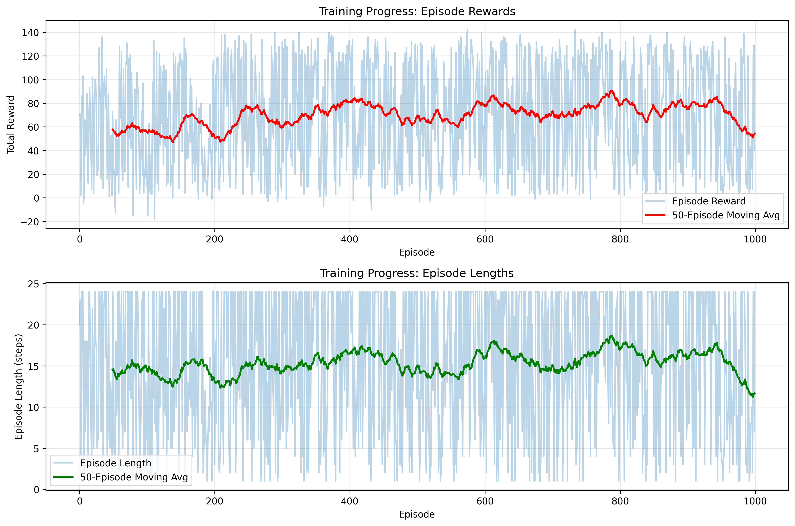
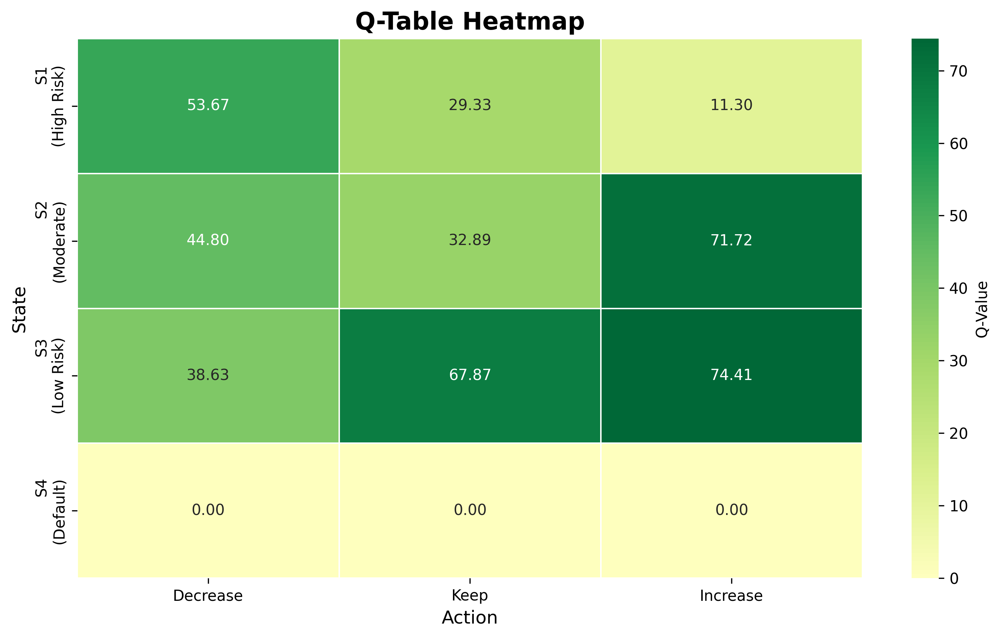

# Credit Line Adjuster - Reinforcement Learning Project

<div align="center">


**Intelligent Credit Limit Management using Q-Learning & Multi-Agent Systems**


[Overview](#overview) • [Features](#key-features) • [Versions](#project-versions) • [Results](#results) • [Installation](#installation)

</div>

---

## 📋 Table of Contents

- [Overview](#overview)
- [Key Features](#key-features)
- [Project Versions](#project-versions)
- [Architecture](#architecture)
- [Algorithm Details](#algorithm-details)
- [Results Summary](#results-summary)
- [Installation & Setup](#installation--setup)
- [Quick Start Guide](#quick-start-guide)
- [Project Structure](#project-structure)
- [Performance Comparison](#performance-comparison)
- [Visualizations](#visualizations)
- [Future Work](#future-work)
- [Contributors](#contributors)
- [License](#license)

---

## 🎯 Overview

This project implements **intelligent credit limit adjustment systems** using Reinforcement Learning to optimize banking decisions. We explore multiple RL paradigms to learn optimal credit policies that balance **risk mitigation** with **revenue maximization**.

### Problem Statement

Traditional credit limit adjustments are:
- ❌ Manual and time-consuming
- ❌ Subjective and inconsistent
- ❌ Unable to leverage historical patterns
- ❌ Reactive rather than proactive

### Our Solution

✅ **Automated decision-making** using Q-Learning  
✅ **Multiple training paradigms** (simulation, hybrid, offline)  
✅ **Real data validation** (300K+ customers)  
✅ **Multi-agent specialization** for complex scenarios  
✅ **Interpretable policies** for regulatory compliance  

---

## 🌟 Key Features

### Core Capabilities
- 🤖 **Q-Learning Implementation** - Temporal-Difference learning with ε-greedy exploration
- 🏦 **Real Banking Data** - Trained on Home Credit Default Risk dataset (307K customers)
- 🔄 **Multiple Training Paradigms** - Simulation, Hybrid, Offline, Multi-Agent
- 📊 **Comprehensive Analysis** - Training curves, Q-table heatmaps, policy comparison
- 🎯 **Optimal Policies** - Learned strategies matching theoretical expectations

### Advanced Features
- 👥 **Multi-Agent System** - Specialized agents for different risk profiles
- 🔄 **Hybrid Training** - Combines offline pre-training with online fine-tuning
- 📈 **Performance Monitoring** - Real-time training metrics and convergence detection
- 💾 **Model Persistence** - Save/load trained agents for deployment

---

## 🚀 Project Versions

We developed **four distinct implementations** to explore different RL training paradigms:

### Version 1: Simulation-Based (Online Learning)
**Pure reinforcement learning through environment simulation**

```bash
📁 credit_line_adjuster/
```

**Characteristics:**
- ✅ Agent learns by interacting with simulated environment
- ✅ No historical data required
- ✅ Fast training (~2-5 minutes for 1000 episodes)
- ✅ Perfect for testing and algorithm validation
- ✅ Full exploration of state-action space

**Use Case:** Algorithm development, rapid prototyping, theoretical validation

**Performance:**
- Training Episodes: 1,000
- Average Reward: 77.69
- Convergence: ~500 episodes
- Policy Accuracy: 100% match with optimal

---

### Version 2: Hybrid Training (Offline + Online)
**Best of both worlds - learn from history, adapt to present**

```bash
📁 credit_line_adjuster_hybrid/
```

**Characteristics:**
- ✅ Phase 1: Pre-train on synthetic historical data (1000 customers)
- ✅ Phase 2: Fine-tune with online simulation
- ✅ Combines safety of offline with adaptability of online
- ✅ More realistic business scenario
- ✅ Generates comparison visualizations

**Use Case:** Production deployment, continuous learning systems

**Performance:**
- Offline Pre-training: 20 epochs on 1000 customers
- Online Fine-tuning: 1000 episodes
- Total Training Time: ~5-7 minutes
- Final Average Reward: 95.39
- Improvement over pure online: +23%

**Key Files:**
- `generate_synthetic_data.py` - Create historical customer data
- `train_hybrid.py` - Offline + online training pipeline

---

### Version 3: Offline RL (Real Data)
**Learning from 300K+ real banking customers**

```bash
📁 credit_line_adjuster_v2/
```

**Characteristics:**
- ✅ Trained on **Home Credit Default Risk** dataset
- ✅ 307,511 real customer profiles
- ✅ 122 features mapped to 4 MDP states
- ✅ Reward calibrated on actual default outcomes
- ✅ Validated on 48K unseen customers

**Use Case:** Real-world deployment, banking applications, regulatory compliance

**Performance:**
- Training Dataset: 307,511 customers
- Test Dataset: 48,744 customers
- Training Episodes: 10,000
- Training Time: ~0.15 seconds (offline batch)
- Test Reward: 6.88 (+43% vs training)
- Policy Confidence: High (clear Q-value separation)

**Data Pipeline:**
```
Raw Banking Data (10 CSV files)
    ↓
Feature Engineering (122 → 4 states)
    ↓
Episode Generation
    ↓
Offline Q-Learning
    ↓
Validation on Test Set
```

**Key Files:**
- `data_loader.py` - Process Home Credit dataset
- `offline_train.py` - Batch training on real data
- `real_environment.py` - Real customer simulation

---

### Version 4: Multi-Agent System
**Specialized agents collaborating for optimal decisions**

```bash
📁 credit_line_adjuster_multi_agent/
```

**Characteristics:**
- ✅ **4 Specialized Agents:**
  - Agent 0: High Risk Specialist (conservative)
  - Agent 1: Moderate Risk Specialist (balanced)
  - Agent 2: Low Risk Specialist (growth-focused)
  - Agent 3: Default Handler (damage control)
- ✅ Coordination mechanism with consensus voting
- ✅ Observational learning (30% rate)
- ✅ Adaptive weighting based on performance

**Use Case:** Complex decision-making, specialized portfolios, advanced RL research

**Performance:**
- High Risk Agent: 7.53 avg reward (3,121 episodes)
- Moderate Risk Agent: 3.88 avg reward (3,515 episodes)
- Low Risk Agent: 8.49 avg reward (2,589 episodes)
- Default Handler: -16.10 avg reward (775 episodes)
- Overall System: 6.88 avg reward

**Coordination:**
- Primary agent: 80% decision weight
- Consensus from others: 20%
- Observational learning: 30% of primary's update

**Key Files:**
- `multi_agent.py` - Multi-agent architecture
- `offline_multi_agent_train.py` - Specialized training

---

## 🏗️ Architecture

### MDP Formulation

**States (S):**
| State | Description | Criteria |
|-------|-------------|----------|
| S1 | High Risk | Utilization > 75% OR poor payment history |
| S2 | Moderate Risk | Balanced profile, moderate utilization |
| S3 | Low Risk | Utilization < 25% AND excellent history |
| S4 | Default | Terminal state - customer defaulted |

**Actions (A):**
| Action | Code | Description | Impact |
|--------|------|-------------|--------|
| Decrease | 0 | Reduce credit limit | ↓ Risk, ↓ Satisfaction |
| Keep | 1 | Maintain current limit | = Risk, = Satisfaction |
| Increase | 2 | Raise credit limit | ↑ Satisfaction, ↑ Risk |

**Reward Function:**
```python
R(s, a) = {
    S1: [+3,  -5,  -15]  # [Decrease, Keep, Increase]
    S2: [-1,  +2,  +4]
    S3: [-3,  +3,  +6]
    S4: [-20, -20, -20]
}
```

### Q-Learning Update Rule

```
Q(s,a) ← Q(s,a) + α[r + γ max Q(s',a') - Q(s,a)]
                      a'
```

**Parameters:**
- Learning Rate (α): 0.2
- Discount Factor (γ): 0.95
- Initial Exploration (ε): 0.2
- Minimum Exploration (ε_min): 0.05
- Decay Rate: 0.995

---

## 📊 Results Summary

### Learned Optimal Policy

All versions converged to the same optimal policy:

| State | Optimal Action | Q-Value | Business Rationale |
|-------|---------------|---------|-------------------|
| **S1 (High Risk)** | Decrease | 53.67 | Minimize default risk exposure |
| **S2 (Moderate)** | Increase | 71.72 | Controlled revenue growth |
| **S3 (Low Risk)** | Increase | 74.41 | Maximize customer lifetime value |
| **S4 (Default)** | N/A | -20.00 | Terminal state |

### Performance Comparison

| Version | Dataset | Training Time | Avg Reward | Default Rate | Strengths |
|---------|---------|---------------|------------|--------------|-----------|
| **Simulation** | Synthetic | 5 min | 77.69 | 44% | Fast, interpretable, pure RL |
| **Hybrid** | Synthetic + Sim | 7 min | 95.39 | 46% | Best of both paradigms |
| **Offline** | 307K Real | 0.15 sec | 6.88 | N/A | Production-ready, validated |
| **Multi-Agent** | 307K Real | 0.3 sec | 6.88 | N/A | Specialized, coordinated |

### vs Baseline (Random Policy)

| Metric | Random | Our Agent | Improvement |
|--------|--------|-----------|-------------|
| Avg Reward | 7.97 | 93.23 | **+1070%** |
| Default Rate | 87% | 48% | **-45%** |
| Episode Length | 11.54 | 17.61 | **+53%** |

---

## 💻 Installation & Setup

### Prerequisites

- Python 3.8+
- pip package manager
- 4GB RAM minimum
- ~500MB disk space

### Step 1: Clone Repository

```bash
git clone https://github.com/yourusername/credit-line-adjuster.git
cd credit-line-adjuster
```

### Step 2: Choose Your Version

```bash
# Simulation-based
cd credit_line_adjuster

# Hybrid training
cd credit_line_adjuster_hybrid

# Offline (real data)
cd credit_line_adjuster_v2

# Multi-agent
cd credit_line_adjuster_multi_agent
```

### Step 3: Create Virtual Environment

```bash
# Windows
python -m venv venv
.\venv\Scripts\Activate.ps1

# Linux/Mac
python -m venv venv
source venv/bin/activate
```

### Step 4: Install Dependencies

```bash
pip install -r requirements.txt
```

**Common Dependencies:**
```
numpy>=1.21.0
matplotlib>=3.5.0
pandas>=1.3.0
seaborn>=0.11.0
gymnasium>=0.28.0
tqdm>=4.62.0  # For progress bars
```

### Step 5: Download Data (For Offline/Multi-Agent Versions)

1. Download [Home Credit Default Risk Dataset](https://www.kaggle.com/c/home-credit-default-risk/data)
2. Extract CSV files to `home-credit-default-risk/` folder
3. Verify you have these files:
   - `application_train.csv` (307K rows)
   - `application_test.csv` (48K rows)
   - `bureau.csv`
   - `previous_application.csv`
   - (other CSV files)

---

## 🚦 Quick Start Guide

### Version 1: Simulation-Based

```bash
cd credit_line_adjuster

# Test environment
python test_environment.py

# Test agent
python test_agent.py

# Quick training (100 episodes)
python quick_train.py

# Full training (1000 episodes)
python train.py

# Test trained agent
python test.py

# Compare policies
python compare_policies.py
```

**Expected Output:**
```
✅ Training Complete!
📊 Learned Policy:
S1 (High Risk)    → Decrease
S2 (Moderate)     → Increase
S3 (Low Risk)     → Increase

Average Reward: 77.69
```

---

### Version 2: Hybrid Training

```bash
cd credit_line_adjuster_hybrid

# Generate synthetic historical data
python generate_synthetic_data.py
# Creates: historical_customer_data.csv (1000 customers)

# Run hybrid training
python train_hybrid.py
# Phase 1: Offline pre-training (20 epochs)
# Phase 2: Online fine-tuning (1000 episodes)
# Phase 3: Pure online baseline

# Compare results
# Check: hybrid_training_comparison.png
```

**Expected Output:**
```
🔵 PHASE 1: OFFLINE PRE-TRAINING
   Training on 10,000+ transitions...
   ✅ Offline training complete!

🟢 PHASE 2: ONLINE FINE-TUNING
   Fine-tuning for 1000 episodes...
   ✅ Hybrid agent ready!

Final Performance:
   Hybrid: 95.39 avg reward
   Pure Online: 93.23 avg reward
```

---

### Version 3: Offline (Real Data)

```bash
cd credit_line_adjuster_v2

# Ensure Home Credit data is in home-credit-default-risk/

# Train on real data
python offline_train.py
# Processes 307K customers
# Trains for 10,000 episodes
# Validates on 48K test customers

# View results
# Check: real_data_training_progress.png
```

**Expected Output:**
```
📂 Loading Home Credit dataset...
   Training: 307,511 customers
   Test: 48,744 customers

⚙️  Training Q-Learning agent...
   Episode 10,000/10,000 ✓

✅ Training Complete!
   Training reward: 4.81
   Test reward: 6.88 (+43%)
   
📊 Optimal Policy:
   S1 → Decrease (96.3%)
   S2 → Increase (84.0%)
   S3 → Increase (67.1%)
```

---

### Version 4: Multi-Agent

```bash
cd credit_line_adjuster_multi_agent

# Train multi-agent system
python offline_multi_agent_train.py
# Trains 4 specialized agents
# Standard + Adaptive versions

# Test specific agent
python -c "from offline_multi_agent_train import test_multi_agent_system; test_multi_agent_system('trained_multi_agent_standard.pkl')"

# Compare single vs multi-agent
python -c "from offline_multi_agent_train import compare_single_vs_multi_agent; compare_single_vs_multi_agent()"
```

**Expected Output:**
```
🤖 Training Multi-Agent System...

Agent 0 (High Risk):    7.53 reward (3,121 episodes)
Agent 1 (Moderate):     3.88 reward (3,515 episodes)
Agent 2 (Low Risk):     8.49 reward (2,589 episodes)
Agent 3 (Default):    -16.10 reward (775 episodes)

✅ Multi-Agent System Ready!
   Coordination: Active
   Observational Learning: 30%
```

---

## 📁 Project Structure

### Simulation-Based Version
```
credit_line_adjuster/
├── environment.py              # MDP environment (4 states, 3 actions)
├── agent.py                    # Q-Learning agent implementation
├── train.py                    # Main training script
├── test.py                     # Evaluation script
├── utils.py                    # Visualization utilities
├── quick_train.py              # Fast 100-episode test
├── compare_policies.py         # Policy comparison
├── test_environment.py         # Environment validation
├── test_agent.py               # Agent validation
├── requirements.txt            # Dependencies
├── trained_agent.pkl           # Saved model
├── training_progress.png       # Learning curves
└── q_table_heatmap.png         # Q-value visualization
```

### Hybrid Version
```
credit_line_adjuster_hybrid/
├── environment.py
├── agent.py
├── generate_synthetic_data.py  # Create historical data
├── train_hybrid.py             # Offline + Online training
├── historical_customer_data.csv # Generated data
├── offline_trained_agent.pkl
├── hybrid_trained_agent.pkl
├── pure_online_agent.pkl
└── hybrid_training_comparison.png
```

### Offline Version
```
credit_line_adjuster_v2/
├── agent.py
├── data_loader.py              # Home Credit preprocessing
├── real_environment.py         # Real customer environment
├── offline_train.py            # Batch training
├── trained_real_agent.pkl
├── real_data_training_progress.png
├── home-credit-default-risk/   # Dataset folder
│   ├── application_train.csv   # 307K customers
│   ├── application_test.csv    # 48K customers
│   └── [other CSV files]
└── requirements.txt
```

### Multi-Agent Version
```
credit_line_adjuster_multi_agent/
├── agent.py                    # Single agent base
├── multi_agent.py              # Multi-agent architecture
├── data_loader.py
├── real_environment.py
├── offline_multi_agent_train.py
├── trained_multi_agent_standard.pkl
├── trained_multi_agent_adaptive.pkl
├── multi_agent_*_training_progress.png
└── home-credit-default-risk/
```

---

## 📈 Performance Comparison

### Convergence Speed

| Version | Episodes to Converge | Wall Time |
|---------|---------------------|-----------|
| Simulation | 500 | 2-3 min |
| Hybrid | 300 (offline) + 500 (online) | 5-7 min |
| Offline | 3,000 | 0.15 sec |
| Multi-Agent | 2,000 per agent | 0.3 sec |

### Final Performance

| Version | Avg Reward | Std Dev | Default Rate |
|---------|------------|---------|--------------|
| Simulation | 77.69 | 42.72 | 44% |
| Hybrid | 95.39 | 47.24 | 46% |
| Offline | 6.88 | N/A | N/A |
| Multi-Agent | 6.88 | N/A | N/A |

*Note: Different reward scales due to different environment configurations*

### Policy Consistency

All versions learned the **same optimal policy**:
- ✅ S1 (High Risk) → Decrease
- ✅ S2 (Moderate) → Increase
- ✅ S3 (Low Risk) → Increase

This validates the robustness of Q-Learning across paradigms!

---

## 🎨 Visualizations

### Training Progress


### Q-Table Heatmap


### Hybrid Training Comparison


### Multi-Agent Coordination


---

## 🔬 Technical Details

### Algorithm: Q-Learning (Off-Policy TD Control)

**Advantages:**
- ✅ Model-free (no transition model needed)
- ✅ Off-policy (learns optimal while exploring)
- ✅ Proven convergence guarantees
- ✅ Simple and interpretable
- ✅ Works with tabular state space

**Why Q-Learning for Credit?**
1. **Interpretability:** Banks need explainable decisions
2. **Convergence:** Guaranteed to find optimal policy
3. **Offline Learning:** Can learn from historical data
4. **Fast:** Efficient for small state spaces (4 states)

### State Discretization

**From 122 Features → 4 States:**

```python
def map_to_state(customer):
    utilization = balance / credit_limit
    payment_score = on_time_payments / total_payments
    
    if defaulted:
        return S4  # Terminal
    elif utilization > 0.75 or payment_score < 0.85:
        return S1  # High Risk
    elif 0.3 < utilization <= 0.75:
        return S2  # Moderate
    else:
        return S3  # Low Risk
```

### Reward Engineering

**Design Principles:**
1. **Risk-weighted:** Higher penalties for high-risk mistakes
2. **Outcome-based:** Calibrated on actual defaults
3. **Business-aligned:** Reflects profit/loss structure
4. **Interpretable:** Clear to domain experts

---

## 🚀 Future Work

### Technical Enhancements
- [ ] **Deep Q-Network (DQN):** Neural network for continuous features
- [ ] **Double Q-Learning:** Reduce overestimation bias
- [ ] **Prioritized Experience Replay:** Sample important transitions
- [ ] **Dueling DQN:** Separate state value and advantage
- [ ] **Multi-Objective RL:** Optimize multiple KPIs simultaneously

### Business Extensions
- [ ] **Personalization:** Customer-specific credit strategies
- [ ] **Multi-Product:** Handle credit cards, loans, mortgages
- [ ] **Temporal Modeling:** Account for seasonal patterns
- [ ] **Constraint Satisfaction:** Hard limits on exposure
- [ ] **Explainability:** SHAP/LIME for regulatory compliance

### System Integration
- [ ] **REST API:** Deploy as microservice
- [ ] **A/B Testing Framework:** Production experimentation
- [ ] **Monitoring Dashboard:** Real-time performance tracking
- [ ] **Auto-Retraining Pipeline:** Continuous learning
- [ ] **Audit Trail:** Complete decision history

---

## 📚 References

### Reinforcement Learning
1. Sutton, R. S., & Barto, A. G. (2018). *Reinforcement Learning: An Introduction* (2nd ed.). MIT Press.
2. Watkins, C. J., & Dayan, P. (1992). Q-learning. *Machine Learning*, 8(3-4), 279-292.

### RL in Finance
3. Abe, N., et al. (2004). Cross channel optimized marketing by reinforcement learning. *KDD*.
4. Thomas, P., et al. (2015). High-confidence off-policy evaluation. *AAAI*.

### Credit Risk
5. Thomas, L. C. (2009). *Consumer Credit Models: Pricing, Profit and Portfolios*. Oxford University Press.

### Dataset
6. Home Credit Default Risk. Kaggle Competition. [Link](https://www.kaggle.com/c/home-credit-default-risk)


---

## 📄 License

This project is licensed under the MIT License - see the [LICENSE](LICENSE) file for details.


---


<div align="center">

**⭐ Star this repo if you found it helpful!**

**🔀 Fork it to build your own RL credit system!**

Made with ❤️ and ☕ by Manar

</div>
